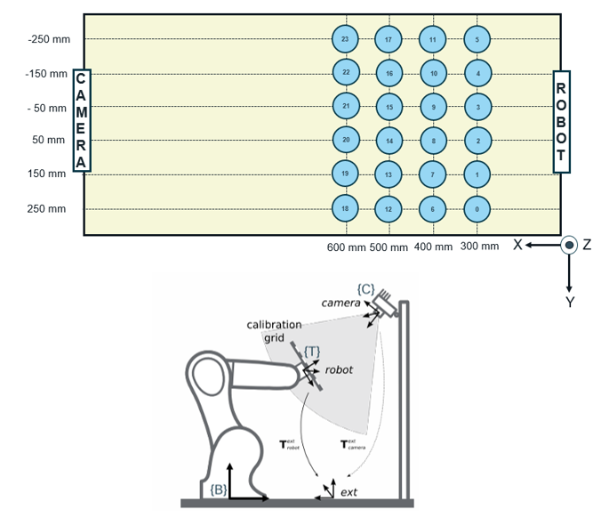

# AI Reliability in Industrial Safety: A Case Study with ABB IRB 1200 and Intel RealSense D415

## Overview
This project explores the application of advanced AI techniques to enhance industrial safety with the ABB IRB 1200 robotic system and Intel RealSense D415 camera. Supervised by Mathias Verbeke and Matthias De Ryck at KU Leuven, Faculty of Engineering Technology, this work is a significant part of the academic curriculum for the Master of AI in Business and Industry, academic year 2023-2024.

## Project Description
The main objective of this study is to assess and improve the reliability of AI systems in industrial environments. By integrating computer vision and robotics, the project aims to enhance the accuracy and safety of industrial robots during operation.

## Methodology
The project follows a structured approach involving several key stages:
1. **Image Acquisition and Preprocessing**: Using the Intel RealSense D415, raw images are captured and processed to correct distortions and generate masks.
2. **3D Object Localization**: Objects are located in 3D space by transforming camera coordinates to robot base coordinates.
3. **Tool and Camera Calibration**: Continuous calibration updates to account for tool wear and camera shifts.
4. **Uncertainty Handling**: Techniques to manage and mitigate uncertainty in robot operations are explored, including runtime monitoring and predictive uncertainty estimation using neural networks.

## Key Components

## Key Components

### U-Net for Image Segmentation
| Name     | Description                                    |
|----------|------------------------------------------------|
| utils.py | Contains utility functions for implementing the U-Net algorithm. |
| model.py | Provides the framework of the U-Net model architecture. |
| train.py | Script for training the U-Net model. |
| test.py  | Script for testing the U-Net model. |

### MLP Models for Predictive Analysis
| Name | Description |
|------|-------------|
| mlp  | Contains the framework and training scripts for Multilayer Perceptrons (MLP) models, which predict and adjust the robot's actions in real-time. |

### Evaluation Metrics
| Metrics    | Description |
|------------|-------------|
| Accuracy, Dice Score, Binary Cross-Entropy | Used to measure the performance of the AI models. |

### Dataset
| Name                     | Description                                                                                                   |
|--------------------------|---------------------------------------------------------------------------------------------------------------|
| dataset.py               | Manages the dataset composed of data points (image, mask, gt_label) for each piece within the robot's range of vision. |
| dataset_augmentation.py  | Enhances the dataset with additional augmented data points.                                                   |

### Support Scripts
| Name                    | Description |
|-------------------------|-------------|
| Binarise_mask.py        | Ensures that the masks of the pieces are binary. |
| Mask2label.py           | Intermediary script between the U-Net segmented masks and MLP input, extracting geometric properties from the segmented image. |
| scale_factors_gt.txt    | Contains the scaling factors for normalizing MLP outputs. |
| scale_factors.txt       | Contains the scaling factors for normalizing MLP inputs. |

## Results
Preliminary results indicate a high degree of accuracy in object localization and a promising ability to handle operational uncertainties in real-time.

## Future Work
Further research will focus on improving the depth perception of images, refining the machine learning models, and expanding the dataset for better generalization of the AI models in different industrial settings.

## Contributors
- Iñigo Aduna Alonso (Researcher)
- Mathias Verbeke (Supervisor)
- Matthias De Ryck (Co-Supervisor)
